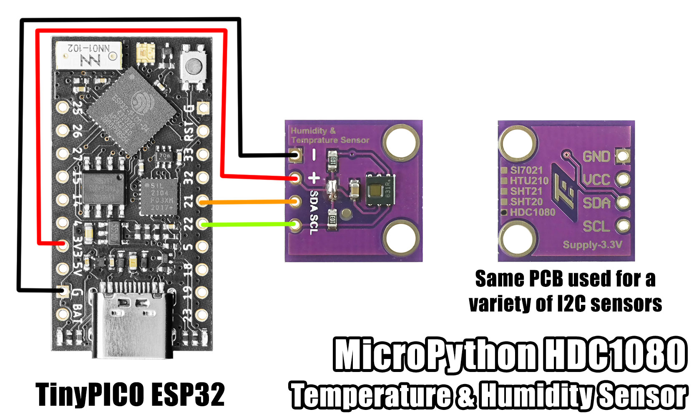

# MicroPython HDC1080 Temperature & Humidity Sensor

A MicroPython library for the TI HDC1080 low power, high accuracy digital humidity and temperature sensor with I2C Interface.



### Installation

Using mip via mpremote:

```bash
$ mpremote mip install github:mcauser/micropython-hdc1080
$ mpremote mip install github:mcauser/micropython-hdc1080/examples
```

Using mip directly on a WiFi capable board:

```python
>>> import mip
>>> mip.install("github:mcauser/micropython-hdc1080")
>>> mip.install("github:mcauser/micropython-hdc1080/examples")
```

Manual installation:

Copy `src/hdc1080.py` to the root directory of your device.

## Examples

**Basic usage**

```python
from machine import I2C, Pin
i2c = I2C(0)

i2c.scan()
# [64]

from hdc1080 import HDC1080
hdc = HDC1080(i2c)

# set humidity resolution (in bits)
hdc.config(humid_res=8)
hdc.config(humid_res=11)
hdc.config(humid_res=14)
# as resolution increases, conversion time increases
# 8-bit 2.5ms, 11-bit 3.85ms, 14-bit 6.5ms

# set temperature resolution (in bits)
hdc.config(temp_res=11)
hdc.config(temp_res=14)
# as resolution increases, conversion time increases
# 11-bit 3.65ms, 14-bit 6.35ms

# set acquisition mode
hdc.config(mode=0)
hdc.config(mode=1)
# 0 measure temp or humidity
# 1 measure temp and humidity

# toggle heater
hdc.config(heater=0)
hdc.config(heater=1)
# 0 turns heater off
# 1 turns heater on
# heater can be used to test the sensor or drive off condensation after long exposure to high humidity

hdc.temperature()
# eg 20.78735

hdc.humidity()
# eg 60.83984

# software reset
hdc.reset()

# look for the HDC1080 sensor on the I2C bus
hdc.check()
# returns True if the device was found

hdc.battery_status()
# returns 0 if Vcc > 2.8V
# returns 1 if Vcc < 2.8V
# useful in low power battery powered systems, to inform user to replace batteries

hdc.serial_number()
# returns eg 9816972135, a 40-bit unique serial per individual HDC1080

hdc.manufacturer_id()
# returns 21577 or 0x5449
# which can be represented as b'TI' for Texas Instruments

hdc.device_id()
# returns 4176 or 0x1050
# don't ask me why it's 1050 and not 1080 - that's just how it is in the datasheet
```

## Parts

* [HDC1080 module](https://s.click.aliexpress.com/e/_DBqFmVn)
* [TinyPICO](https://www.tinypico.com/)

## Connections

### TinyPICO ESP32

```python
from machine import SoftI2C, Pin
i2c = SoftI2C(scl=Pin(22), sda=Pin(21))

from machine import I2C, Pin
i2c = I2C(0)
```

HDC1080 | TinyPICO (ESP32)
------- | ----------------
VCC     | 3V3
GND     | GND
SCL     | 22 (SCL)
SDA     | 21 (SDA)

## Links

* [micropython.org](http://micropython.org)
* [HDC1080 product page](https://www.ti.com/product/HDC1080)
* [HDC1080 datasheet](docs/hdc1080.pdf)
* [HDC1080 datasheet](https://www.ti.com/lit/ds/symlink/hdc1080.pdf)
* [TinyPICO Getting Started](https://www.tinypico.com/gettingstarted)

## License

Licensed under the [MIT License](http://opensource.org/licenses/MIT).

Copyright (c) 2024 Mike Causer
